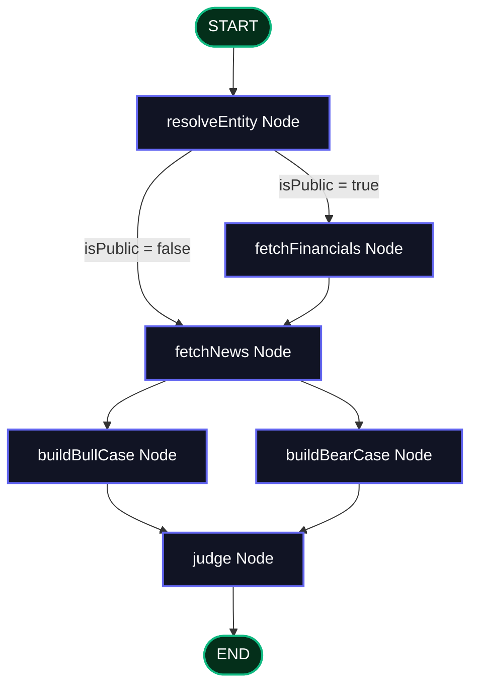

# Investment Research Agent

A premium, full-stack Investment Research Terminal that leverages a multi-agent debate framework to analyze equities. Built using **LangGraph.js**, **Express**, and **React (Vite + TypeScript)**, the system performs adaptive research depth, fanned-out qualitative/quantitative evaluations, and runs an LLM-informed committee debate to generate a final structured verdict.

---

## 🚀 Key Differentiators & Features
1. **Adaptive Research Depth**: Automatically determines if an entity is public or private. Public equities fetch financials and sentiment. Private startups bypass financials (logging the skip in the stepper) and perform purely qualitative research, capping confidence at 75% and warning the user of data omissions.
2. **Coded Rubric Nudge**: Uses deterministic math to score Financial Health and Valuation, passing them to the Lead Judge as supporting context rather than hard rules. The LLM retains final creative judgment.
3. **Structured Debate Pattern**: Fans out optimistic Bull Case and cynical Bear Case nodes in parallel to debate the investment before merging into a unified verdict.
4. **Live Stepper & Log Terminal**: Connects to the Express backend using Server-Sent Events (SSE) via a custom fetch Web Streams reader, showing real-time node execution progress and terminal outputs.
5. **Harmonious Dark Theme**: Sleek glassmorphic components, glowing accent charts, linear progress indicators, and micro-animations built using vanilla CSS.

---

## 🛠️ Project Structure
```text
investment-research-agent/
├── backend/                  # Express API + LangGraph.js Agent
│   ├── src/
│   │   ├── agent/
│   │   │   ├── state.ts      # Annotation state channels and reducers
│   │   │   ├── nodes.ts      # LLM & lookup node implementations
│   │   │   └── graph.ts      # Compiled LangGraph workflow routing
│   │   └── server.ts         # Express server with Server-Sent Events
│   ├── .env                  # Environment keys (contains Gemini Key)
│   ├── package.json
│   └── tsconfig.json
└── frontend/                 # Vite + React + TypeScript + CSS
    ├── src/
    │   ├── App.tsx           # React UI and SSE custom fetch reader
    │   ├── index.css         # Modern glassmorphism design system
    │   └── main.tsx
    └── package.json
```

---

## 📋 System Flow & Graph Routing



---

## 🔧 Setup & Running

### 1. Environment Configuration
Create a file at `backend/.env`:
```env
PORT=4000
GOOGLE_API_KEY=your_api_key_here
TAVILY_API_KEY=your_optional_tavily_key
ALPHA_VANTAGE_API_KEY=your_optional_alphavantage_key
```
*(If Tavily or Alpha Vantage keys are left empty, the backend automatically falls back to generating realistic mock financials and high-fidelity qualitative news articles via Gemini, ensuring the terminal is fully interactive out-of-the-box.)*

### 2. Start Backend Service
```bash
cd backend
npm install
npm run dev
```
*(Runs tsx watch on `http://127.0.0.1:4000`)*

### 3. Start Frontend Dashboard
```bash
cd ../frontend
npm install
npm run dev
```
*(Serves the UI on `http://localhost:5173/`)*

---

## 💡 Engineering Lessons & Trade-Offs

### 1. LangGraph Node vs. Channel Name Collisions
In LangGraph.js, naming a node exactly the same as an Annotation state key (e.g. naming the bull case node `"bullCase"` which writes to `state.bullCase`) throws a runtime exception:
`Error: bullCase is already being used as a state attribute, cannot also be used as a node name.`
* **Solution**: Renamed the graph nodes to `buildBullCase` and `buildBearCase`, maintaining the state fields as variables.

### 2. State Channel Overwrites (The Object Reducer Gotcha)
By default, unless a channel is defined with a custom reducer, returning a partial update to an object channel (like `rubricScores: { newsSentiment }`) will completely overwrite the entire object, deleting all other properties (like `valuation` or `riskFlags`).
* **Solution**: Configured a custom merge reducer on the `rubricScores` state annotation:
  ```typescript
  rubricScores: Annotation<RubricScores>({
    reducer: (curr, update) => ({ ...curr, ...update }),
    default: () => ({ financialHealth: null, valuation: null, newsSentiment: null, riskFlags: [] }),
  })
  ```

### 3. Native SSE stream parsing for POST requests
The HTML5 `EventSource` API is limited to HTTP GET requests. Because starting an analysis requires sending a payload body `{ companyName }`, we couldn't use `EventSource` directly.
* **Solution**: Implemented a raw stream consumer in `App.tsx` using `fetch` and a `ReadableStreamDefaultReader` with chunk buffering and text decoding. This allows full body payloads and parses chunks into React states in real-time.

### 4. Active API Quota Detection
During verification, the free-tier API returned a `429 (Resource Exhausted)` rate-limit for `gemini-2.0-flash`.
* **Solution**: Created a diagnostic script calling Google's model list and API endpoints, establishing that `gemini-2.5-flash` had active quota and was responsive, which we successfully set as the production engine.
